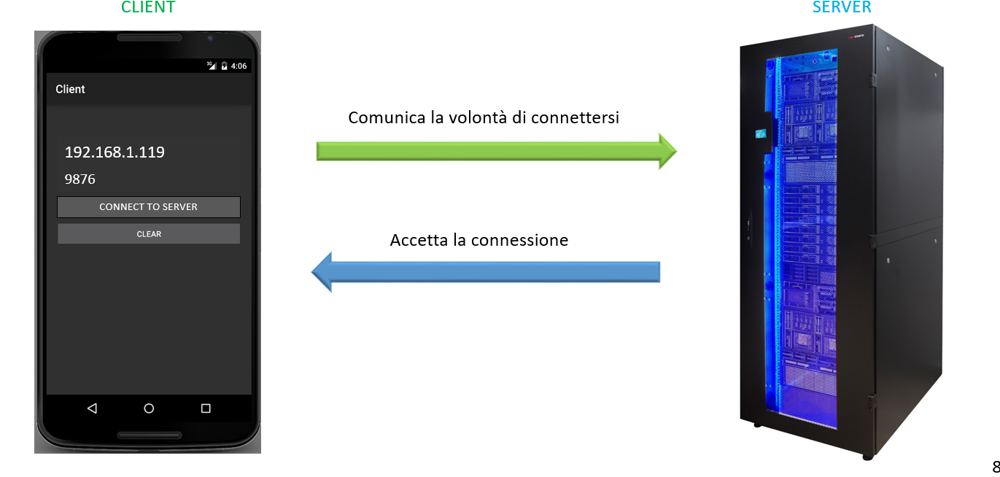
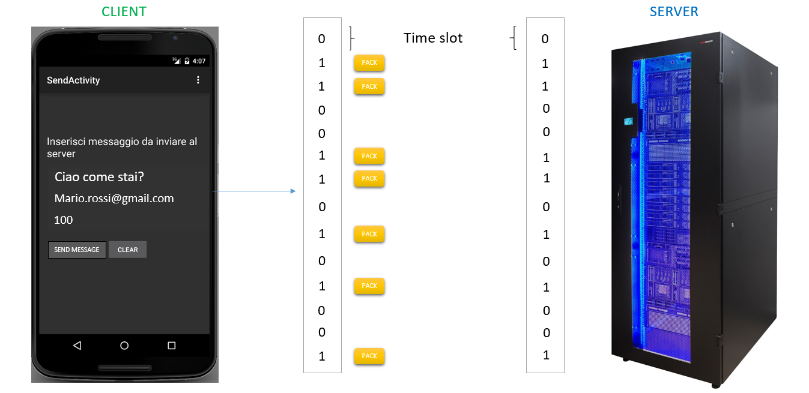
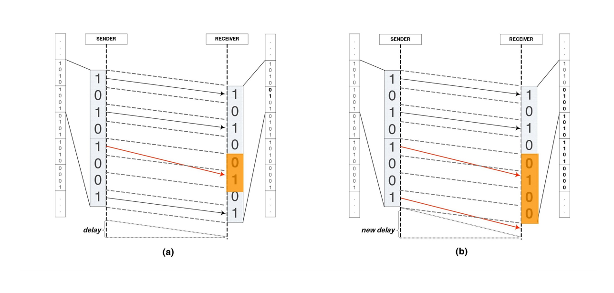

Covert Channel Android
=========
In this project is developed an android application able to create a covert channel between a mobile device and a server.

Pre-requisites
--------------
- Android Studio 1.3 with [NDK](https://developer.android.com/ndk/) bundle.

Getting Started
---------------
1. [Download Android Studio](http://developer.android.com/sdk/index.html)
2. Launch Android Studio.
3. Clone this repository.
4. Import the project and export the app on a mobile device.
5. Run The server and start the communication.

Look the powerpoint presentation to see the functioning of the algortithm.

Screenshots
-----------

License
-------
Copyright 2015 Google, Inc.

Licensed to the Apache Software Foundation (ASF) under one or more contributor
license agreements.  See the NOTICE file distributed with this work for
additional information regarding copyright ownership.  The ASF licenses this
file to you under the Apache License, Version 2.0 (the "License"); you may not
use this file except in compliance with the License.  You may obtain a copy of
the License at

  http://www.apache.org/licenses/LICENSE-2.0

Unless required by applicable law or agreed to in writing, software
distributed under the License is distributed on an "AS IS" BASIS, WITHOUT
WARRANTIES OR CONDITIONS OF ANY KIND, either express or implied.  See the
License for the specific language governing permissions and limitations under
the License.
